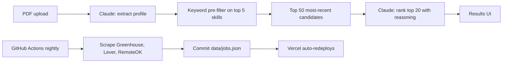

# Job Cannon

**Live demo:** [job-cannon.vercel.app](https://job-cannon.vercel.app/)

AI-powered resume-to-job matching. Drop a PDF resume on the landing page; Claude extracts a structured profile, scans thousands of fresh postings from Greenhouse, Lever, and RemoteOK, and returns the 20 best fits with reasoning for each.

_(Screenshot will land here after the first production deploy.)_

## How the matching works

This is the part that matters for the design choice.



I deliberately chose **keyword pre-filter + LLM re-rank** instead of vector embeddings. At MVP scale (~5K jobs) with a structured domain (tech jobs always list skills explicitly), keyword filtering has better precision and zero embedding infrastructure. Two Claude calls — one for extraction, one for ranking — cover the entire pipeline. No vector store, no DB, no second AI vendor.

A single `POST /api/match` endpoint runs the whole flow:

1. Parse the multipart PDF (size + magic-byte check).
2. Call Claude with the PDF as a `document` content block, forcing a `submit_profile` tool call. Zod-validate the tool input; retry once with the validation error replayed.
3. Load `data/jobs.json` (lazily cached in-process).
4. Keyword pre-filter: keep jobs whose `title + description` contains any of the candidate's top-5 skills (case-insensitive substring). Sort by `posted_at` desc. Take top 50. Fall back to the 50 most-recent overall if matches < 10.
5. Send those 50 + the profile back to Claude, forcing a `submit_rankings` tool call. Validate ids belong to the candidate set; retry once on mismatch.
6. Return `{ ok: true, profile, results }`.

No `/results/[id]` route. No persistence of match results. Re-upload to re-match.

## Tech stack

- **Framework:** Next.js 16 (App Router) + TypeScript strict
- **UI:** Tailwind v4 + shadcn/ui (Card, Badge, Button, Input, Progress, Skeleton)
- **AI:** Anthropic Claude API — `claude-sonnet-4-6`, native PDF document support, tool use for structured outputs
- **Validation:** Zod 4 (with `z.toJSONSchema` for tool input schemas)
- **Data store:** `data/jobs.json` (committed; ~4K jobs after first scrape)
- **Scraping:** Native `fetch` against public JSON APIs (Greenhouse boards-api, Lever postings, RemoteOK feed). No browser automation.
- **Hosting:** Vercel (web) + GitHub Actions (nightly scrape commits jobs.json → Vercel redeploys)
- **Package manager:** pnpm

## Local setup

```bash
pnpm install
cp .env.local.example .env.local   # then fill in ANTHROPIC_API_KEY
pnpm dev
```

To refresh the job set:

```bash
pnpm scrape
```

## Environment variables

| Name                | Required | Used in           | Purpose                                |
| ------------------- | -------- | ----------------- | -------------------------------------- |
| `ANTHROPIC_API_KEY` | yes      | `app/api/match`   | PDF extraction + ranking Claude calls. |

The nightly GitHub Actions scrape needs **no secrets** — it only hits public JSON endpoints.

## Project layout

```
app/api/match/route.ts          POST endpoint: PDF in, ranked matches out
app/page.tsx                    Landing page (server) + <MatchClient />
components/                     UI: MatchClient, JobCard, ProfileSummary, MatchScoreRing
lib/ai/                         Anthropic client + extract.ts + rank.ts
lib/jobs.ts                     Lazy-cached jobs + preFilter
lib/scrapers/                   One file per source + html stripper
lib/types.ts                    Job + Profile + RankedJobs Zod schemas
scripts/scrape.ts               Orchestrator for `pnpm scrape`
data/jobs.json                  Committed job index, refreshed nightly
.github/workflows/scrape.yml    Nightly cron
```

## License

MIT — see [LICENSE](./LICENSE).
