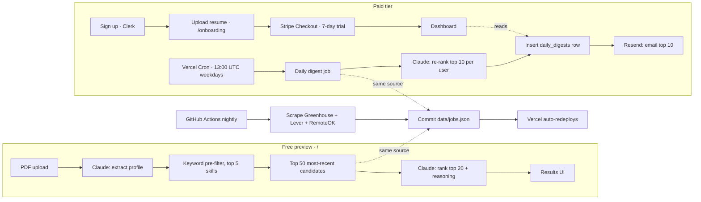

# Job Cannon

**Live demo:** [jobcannon.app](https://jobcannon.app/)

Drop a resume PDF and get a ranked list of best-fit startup jobs with reasoning for each match. **Free preview** is public - no account, no email gating. **Paid plan** ($8/mo or $60/yr, 7-day free trial) delivers the top 10 to your inbox every weekday at 8am ET, with a 30-day match history dashboard.

> Recruiters: skip the README - the live demo above takes 30 seconds to try.

_(Screenshot will land here after the first production launch.)_

## How it works

Two layers. The MVP shipped first; the SaaS layer wraps it without changing the free path.



### Why keyword pre-filter + LLM re-rank, not embeddings

This is the design-choice section to flag for engineering interviewers.

At MVP scale (~5K jobs) with a structured domain (tech jobs always list skills explicitly), **keyword pre-filtering has better precision than vector embeddings** and requires zero embedding infrastructure. Two Claude calls - one for extraction, one for ranking - cover the entire pipeline. No vector store, no second AI vendor, no embedding-drift gotchas.

The full flow inside `POST /api/match`:

1. Parse the multipart PDF (size + magic-byte check).
2. Call Claude with the PDF as a `document` content block, forcing a `submit_profile` tool call. Zod-validate the tool input; retry once with the validation error replayed.
3. Load `data/jobs.json` (lazily cached in-process).
4. Keyword pre-filter: keep jobs whose `title + description` contains any of the candidate's top-5 skills (case-insensitive substring). Sort by `posted_at` desc. Take top 50. Fall back to the 50 most-recent overall if matches < 10.
5. Send those 50 + the profile back to Claude, forcing a `submit_rankings` tool call. Validate ids belong to the candidate set; retry once on mismatch.
6. Return `{ ok: true, profile, results }`.

### How the daily digest works (paid tier)

`POST/GET /api/cron/daily-digest` (Bearer-auth via `CRON_SECRET`, fired by Vercel Cron at 13:00 UTC Mon–Fri):

1. Join `users + subscriptions(trialing|active) + resumes(isActive=true)` to get eligible subscribers.
2. Load `data/jobs.json` once.
3. For each subscriber, with concurrency 5:
   - Idempotency check on `(userId, digestDate)` - skip if today's row exists.
   - Pre-filter the 30 most-relevant candidates (smaller pool than MVP's 50 - per-user cost matters).
   - Claude ranks the top 10 with reasoning.
   - Insert the `daily_digests` row.
   - Render a React Email template and ship via Resend; on success, stamp `sent_at`.
4. Return `{ processed, sent, errors, skipped, details[] }`.

Idempotency is upsert-based on the unique `(user_id, digest_date)` index, so the cron is safe to retry. Persist-then-send means a failed email leaves the digest visible in the user's dashboard (with `sent_at: null`) instead of dropping the work.

## Pricing

| Plan        | Price | Trial          | What you get                                                  |
| ----------- | ----- | -------------- | ------------------------------------------------------------- |
| **Monthly** | $8/mo | 7-day free     | Daily top-10 email · 30-day history · resume re-upload · cancel anytime |
| **Annual**  | $60/yr | 7-day free     | Same, save $36/yr - four months free                          |

Billing is Stripe-hosted (Checkout + Customer Portal); no card details ever touch our server. Cancellation lives in the Stripe portal, accessible from `/dashboard/billing`.

## Tech stack

| Layer       | Choice                                                                                       |
| ----------- | -------------------------------------------------------------------------------------------- |
| Framework   | Next.js 16 (App Router) + TypeScript strict                                                  |
| UI          | Tailwind v4 + shadcn/ui (base-ui flavor)                                                     |
| Auth        | Clerk (`@clerk/nextjs`)                                                                      |
| Database    | Neon Postgres + Drizzle ORM                                                                  |
| Payments    | Stripe (Checkout + Customer Portal + webhook)                                                |
| Email       | Resend + React Email (server-rendered templates)                                             |
| AI          | Anthropic Claude - `claude-sonnet-4-6`, native PDF document support, tool use for structured output |
| Validation  | Zod 4 (with `z.toJSONSchema` for tool input schemas)                                         |
| Data store  | `data/jobs.json` committed to the repo, refreshed nightly                                    |
| Scraping    | Native `fetch` against public JSON APIs (Greenhouse boards-api, Lever postings, RemoteOK)    |
| Hosting     | Vercel (web + cron) + GitHub Actions (nightly scrape commits back to repo)                   |
| Analytics   | Vercel Analytics                                                                             |
| Package mgr | pnpm                                                                                         |

## Local setup

```bash
pnpm install
cp .env.local.example .env.local
# fill in env vars per the table below
pnpm dev
```

To refresh the job set locally:

```bash
pnpm scrape
```

### Database

During development the schema is applied via Drizzle's `db:push` (no migration files):

```bash
pnpm db:push
```

For production, the workflow switches to generated migrations:

```bash
pnpm db:generate                  # diffs schema → emits SQL in db/migrations/
git commit db/migrations/...      # check the migration into the repo
pnpm db:migrate                   # apply to the production DB
```

### Stripe webhooks during local development

```bash
stripe login                                                # one-time
stripe listen --forward-to localhost:3000/api/webhooks/stripe
# copy the printed "whsec_..." into STRIPE_WEBHOOK_SECRET in .env.local
pnpm dev                                                    # in another terminal
# /pricing → Start free trial → test card 4242 4242 4242 4242 → any future date, any CVC.
```

The production Stripe webhook is a separate endpoint in Stripe's dashboard pointing at `https://<your-domain>/api/webhooks/stripe`, with its own signing secret stored in Vercel.

### Testing the cron locally

```bash
curl -X POST -H "Authorization: Bearer $CRON_SECRET" \
  http://localhost:3000/api/cron/daily-digest
```

Returns a `{ ok, processed, sent, errors, skipped, details[] }` summary including per-user outcomes.

## Environment variables

| Name                                  | Required        | Used in                                | Purpose                                       |
| ------------------------------------- | --------------- | -------------------------------------- | --------------------------------------------- |
| `ANTHROPIC_API_KEY`                   | yes             | `/api/match`, `/api/resume`, cron      | Claude extraction + ranking.                  |
| `DATABASE_URL`                        | SaaS            | Drizzle / Neon HTTP client             | Postgres connection.                          |
| `NEXT_PUBLIC_CLERK_PUBLISHABLE_KEY`   | SaaS            | client                                 | Clerk frontend.                               |
| `CLERK_SECRET_KEY`                    | SaaS            | server                                 | Clerk backend.                                |
| `CLERK_WEBHOOK_SECRET`                | SaaS            | `/api/webhooks/clerk`                  | Svix signature verification.                  |
| `STRIPE_SECRET_KEY`                   | SaaS            | server                                 | Stripe REST calls.                            |
| `STRIPE_WEBHOOK_SECRET`               | SaaS            | `/api/webhooks/stripe`                 | Stripe webhook signature verification.        |
| `NEXT_PUBLIC_STRIPE_PRICE_MONTHLY`    | SaaS            | `/api/checkout` (resolved server-side) | Stripe Price id for the $8/month plan.        |
| `NEXT_PUBLIC_STRIPE_PRICE_YEARLY`     | SaaS            | `/api/checkout` (resolved server-side) | Stripe Price id for the $60/year plan.        |
| `RESEND_API_KEY`                      | SaaS            | cron handler                           | Daily email digest delivery.                  |
| `DIGEST_FROM_EMAIL` (optional)        | SaaS            | cron handler                           | Override the sender once a Resend domain is verified. Defaults to `Job Cannon <onboarding@resend.dev>`. |
| `CRON_SECRET`                         | SaaS            | `/api/cron/daily-digest`               | Bearer auth for Vercel Cron.                  |
| `NEXT_PUBLIC_APP_URL`                 | SaaS (prod)     | Stripe redirects, email links          | Required in production with a custom domain (Vercel's auto-detect resolves to the `.vercel.app` URL). E.g. `https://jobcannon.app`. |

The nightly GitHub Actions scrape needs **no secrets** - it only hits public JSON endpoints.

## Project layout

```
app/
  page.tsx                        Landing (hero · MatchClient · how-it-works · pricing teaser)
  api/match/route.ts              MVP free preview: PDF in, ranked matches out
  api/resume/route.ts             Authed resume upload + persist
  api/checkout/route.ts           Stripe Checkout session creator
  api/portal/route.ts             Stripe Customer Portal session creator
  api/cron/daily-digest/route.ts  Bearer-auth cron handler (Vercel Cron)
  api/webhooks/{clerk,stripe}     Signature-verified event handlers
  sign-in/, sign-up/              Clerk catch-all routes
  onboarding/                     Authed first-resume flow
  dashboard/                      layout + today's digest + history + resume + billing
  pricing/, privacy/, terms/      Marketing + legal pages
components/                       UI islands (MatchClient, JobCard, ProfileSummary,
                                  DashboardNav, NextDigestCountdown, PdfDropzone, etc.)
db/                               Drizzle schema + client (db/migrations/ post-Phase 6)
emails/daily-digest.tsx           React Email template for the daily digest
lib/ai/                           Anthropic client + extract.ts + rank.ts
lib/auth/ensure-user.ts           First-write Clerk-to-Neon mirror helper
lib/email/                        Resend client + greeting + send wrapper
lib/jobs.ts                       Lazy-cached jobs + preFilter
lib/scrapers/                     One file per source + html stripper
lib/stripe/                       Stripe client + sub helpers
lib/types.ts                      Shared Zod schemas + types
proxy.ts                          Clerk middleware (Next 16 file convention)
scripts/scrape.ts                 Orchestrator for `pnpm scrape`
data/jobs.json                    Committed job index, refreshed nightly
vercel.json                       Vercel Cron config (13:00 UTC Mon-Fri)
.github/workflows/scrape.yml      Nightly job-source scrape + commit
```

## License

MIT - see [LICENSE](./LICENSE).
